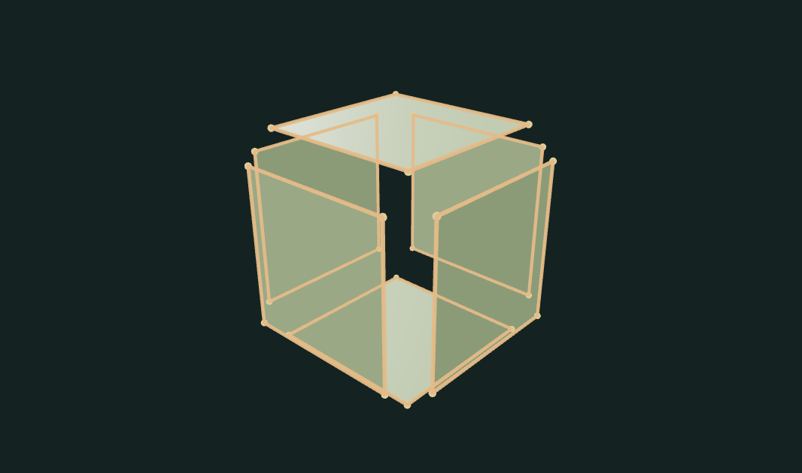
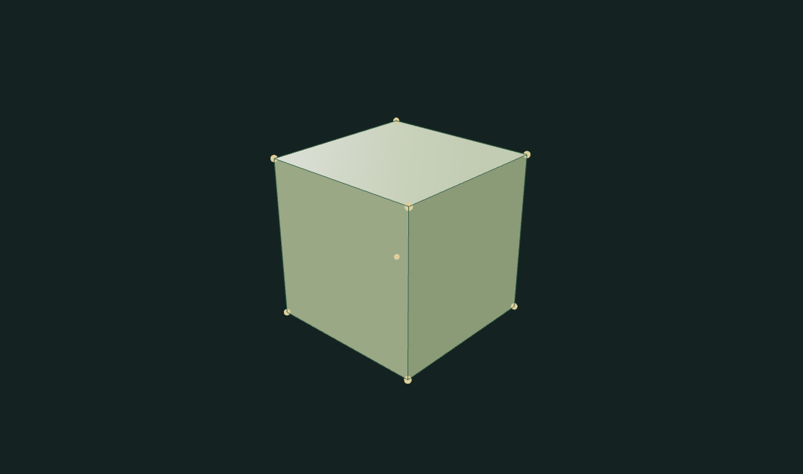

# Mesh Repair Inspector

Inspect a damaged mesh, understand its defects, apply a targeted repair, and compare the actual result. Eight guided examples explain the problem, what to look for, and which operation repairs it. Reports and OBJ exports use the real polygon connectivity.

## Guided examples

| Example | What changes |
| --- | --- |
| Open housing | Weld its split corner, remove the invalid face and stray piece, correct winding, and fill the missing roof. |
| Unwelded cube | Join 24 disconnected corners into 8 shared vertices. The exploded inspection view closes into one piece. |
| Reversed panel | Turn the inward face outward. Its coral highlight and direction arrow reveal a repair that preserves the silhouette. |
| Duplicate panels | Remove coincident front and roof copies. The face count drops from 8 to 6; the solid shape remains. |
| Nonmanifold fin | Remove a single-face appendage from a three-face edge junction, retaining the cube. |
| Loose fragments | Remove two unwanted closed pieces beside the cube. |
| Collapsed face | Remove a triangle with a repeated corner and no area. |
| Clean cube | Confirm that an already valid reference mesh needs no repair. |

Each example preselects its intended operations. Imported meshes start with welding, invalid-face cleanup, and orientation only: deleting smaller pieces, filling holes, and removing fins remain explicit choices for user files.

## Inspection and repairs

- **Problem areas:** thick orange open edges, pink nonmanifold edges, and coral duplicate/reversed panels, collapsed faces, or smaller components.
- **Separate disconnected parts:** temporarily offsets components and displays corner markers so coincident seams are visible. Exported coordinates are unchanged.
- **Face directions:** displays arrows and highlights faces opposite the consistent orientation.
- **Plain surface:** hides diagnostic colors and markers.
- **Original / Working:** compare at the same camera position. The Before / After report and count glossary explain the measured changes.

The repair pipeline welds vertices by spatial hashing and Euclidean tolerance, removes degenerate and duplicate faces, optionally removes isolated fins or smaller components, propagates winding, and caps supported planar boundary loops. Closed components orient outward using signed volume. Hole caps use a local planar projection and ear clipping. Undo retains up to 12 working revisions; Reset preserves the original import.

Reference terminology: [CGAL Polygon Mesh Processing — Mesh Repair](https://cgal.geometryfactory.com/CGAL/doc/main/PMP_Mesh_repair/index.html). This is an independent JavaScript implementation, not a CGAL binding.

## Limits

OBJ input is limited to 2 MB, 20,000 vertices, and 30,000 faces. UVs, materials, and imported normals are not retained. Rendering assumes convex polygons; triangulate concave input faces before upload. Welding with excessive tolerance may collapse small features.

Only simple, nearly planar boundary loops of up to 32 edges can be capped. A single-face fin is removed only when it has one nonmanifold attachment and otherwise boundary edges. Competing solid branches and ambiguous junctions are left unchanged. Keeping the largest component can remove legitimate assembly parts. These choices require understanding the intended model.

Relative winding on an open surface cannot determine a unique outward direction. Nonorientable surfaces may retain conflicts. Self-intersections and printability are not checked. Diagnostic markers are sampled above 1,600 edges/points and 160 face arrows; numerical reports still inspect the full accepted mesh.

## Run and verify

Requires Node.js 22 or later.

```sh
npm ci
npm test
npm run test:browser
npm run dev
npm run build
```

The browser suite requires Playwright Chromium (`npx playwright install chromium`). It repairs and exports every example, verifies actual topology and visible before/after changes, checks undo and coordinate-preserving inspection, and exercises uploads and a 390px mobile viewport.

[Open the portfolio demo](https://zachsm.com/experiments/mesh-workshop?tool=mesh-repair-inspector). The repository runs independently and exports the same implementation used by the portfolio. All processing stays in the browser. No account, server processing, or GitHub Actions is required.

## Captured examples






Exact reproduction steps are recorded in [the example manifest](examples/manifest.json). These are captures from the interactive renderer.
