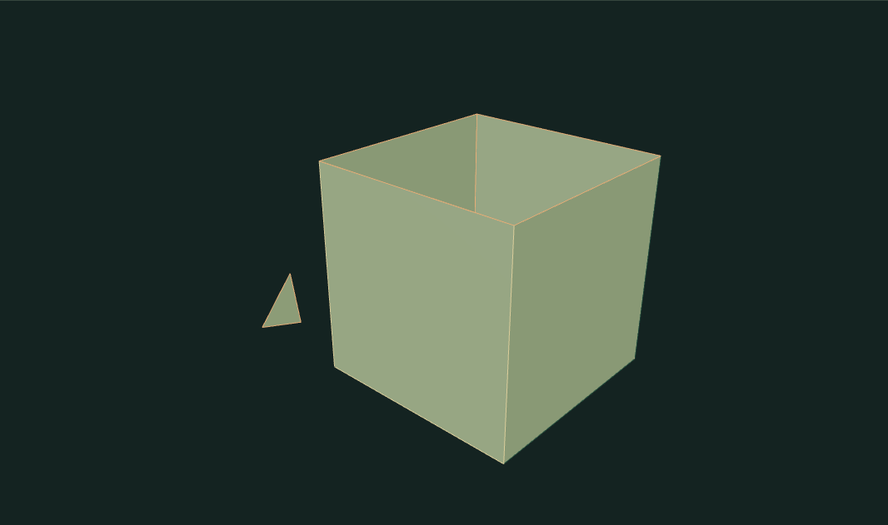
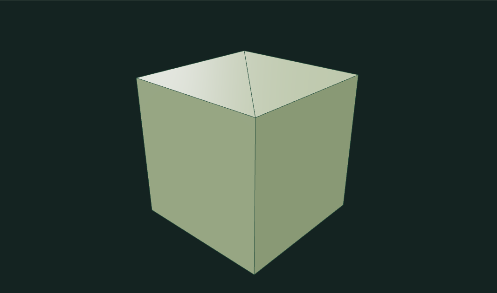

# Mesh Repair Inspector

A working OBJ inspector and repair workbench. Upload a mesh or inspect three intentionally damaged presets. Every diagnostic and repair operates on actual polygon connectivity; before/after views render those meshes.

Run `npm install`, `npm run dev`, `npm test`, `npm run build`.

## What it does

- Parses OBJ vertex and face records, including negative vertex references; enforces finite bounds, 2 MB / 20,000 vertices / 30,000 faces.
- Reports open edges, closed boundary loops, nonmanifold edges, winding conflicts, duplicate/unused vertices, degenerate/duplicate faces and connected components.
- Welds vertices through a spatial hash and Euclidean tolerance. It does not quantize every coordinate.
- Removes degenerate/duplicate polygon faces and compacts unused vertices.
- Propagates relative winding through manifold shared edges. Closed components are oriented outward using signed volume.
- Fills small nearly planar loops by projecting into a local plane and ear-clipping the reversed boundary. Unsupported loops are skipped and counted.
- Optionally keeps only the largest face-connected component, with an explicit warning about legitimate separate pieces.
- Retains the original view, supports a 12-step repair undo history, and exports the working geometry to OBJ.

Reference terminology: [CGAL Polygon Mesh Processing — Mesh Repair](https://cgal.geometryfactory.com/CGAL/doc/main/PMP_Mesh_repair/index.html). This is a small independent JavaScript implementation, not a CGAL binding.

## Limits

UVs, materials and imported normals are not retained. The viewer uses triangle fans for polygon display: triangulate concave input faces before upload. Face welding may collapse small features if the tolerance is excessive. Only simple, nearly planar boundary loops of up to 32 edges can be capped; intended openings should not be filled. Nonmanifold edges are reported, not automatically removed. Relative winding on an open component does not determine a unique outward direction. Nonorientable surfaces may keep winding conflicts. Self-intersections and printability are not checked. These are explicit operations with inspectable results, not a guarantee of a watertight printable solid.

## Run and explore

[Open the portfolio demo](https://zachsm.com/experiments/mesh-repair-inspector). This repository runs independently and exports the same implementation used by the portfolio.

Requires Node.js 22 or later.

```sh
npm ci
npm test
npm run dev
```

`npm run build` produces a static site in `dist`. Editing, uploaded files, and exports stay in the browser. No account, server processing, or GitHub Actions is required.

## Captured examples



An open housing with a split vertex, reversed face winding, a loose island and a degenerate face..



The repaired housing after welding, cleanup, orientation and a planar roof cap..

Exact reproduction steps are recorded in [the example manifest](examples/manifest.json).
